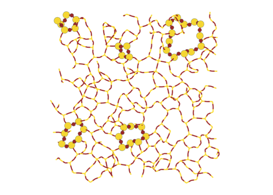

# ring_search
Python script to compute primitive rings of silica structure


## Overview
This project provides tools to analyze silica structures and compute primitive rings using graph theory. It leverages the `networkx` library for graph operations and the `ase` library for handling atomic structures.

## Key Modules

### `Primitive_ring_search.py`
This module defines the `Primitive_ring_search` class, which implements a graph-based algorithm to find primitive rings in a molecular structure. The algorithm is based on the work of Yuan and Cormack.

#### Features:
- **Shortest Path Calculation**: Efficiently computes all shortest paths between nodes in the graph.
- **Primitive Ring Detection**: Identifies primitive rings by combining shortest paths and excluding shortcuts.
- **Visualization**: Provides a method to plot the distribution of ring sizes.

#### Example Usage:
```python
from searching_ring.Primitive_ring_search import Primitive_ring_search
import networkx as nx

# Create a graph
graph = nx.Graph()
graph.add_edges_from([(0, 1), (1, 2), (2, 3), (3, 4), (4, 5), (5, 0)])

# Initialize the search
search = Primitive_ring_search(graph=graph, max_size=6)

# Perform the search
primitive_rings = search.search_primitive_ring()

# Plot the results
search.plot()
```

### `Molecular_Graph.py`
This module defines the `Molecule_To_Graph` class, which converts molecular structures into graph representations. It is particularly useful for analyzing silica structures.

#### Features:
- **Graph Creation**: Converts an ASE `Atoms` object into a `networkx` graph.
- **Periodic Systems**: Handles periodic boundary conditions by creating supercells.
- **Silica-Specific Reduction**: Reduces the graph by removing oxygen atoms and using them to define edges between silicon atoms.

#### Example Usage:
```python
from ase.io import read 

# Create an ASE Atoms object
atoms = read("Quartz_UC.xyz")

# Initialize the graph creation
from searching_ring.Molecular_Graph import Molecule_To_Graph

quartz_graph = Molecule_To_Graph(structure=quartz, periodic=[True, True, True], silica=True, max_ring=14)
# Generate the graph
mol_graph, si_nodes = quartz_graph.full_routine()

from searching_ring.Primitive_ring_search import Primitive_ring_search

silica_ring = Primitive_ring_search(graph=mol_graph, max_size=13, src_nodes=si_nodes)

silica_ring.search_primitive_ring()
```

## Installation
To install the project directly from the Git repository, run:
```bash
pip install git+https://github.com/Crubirig/ring_search
```

## License
This project is licensed under the MIT License. See the [LICENSE](LICENSE) file for details.

## Author
Charles Rubirigi  
Email: charles.rubirigi@unamur.be